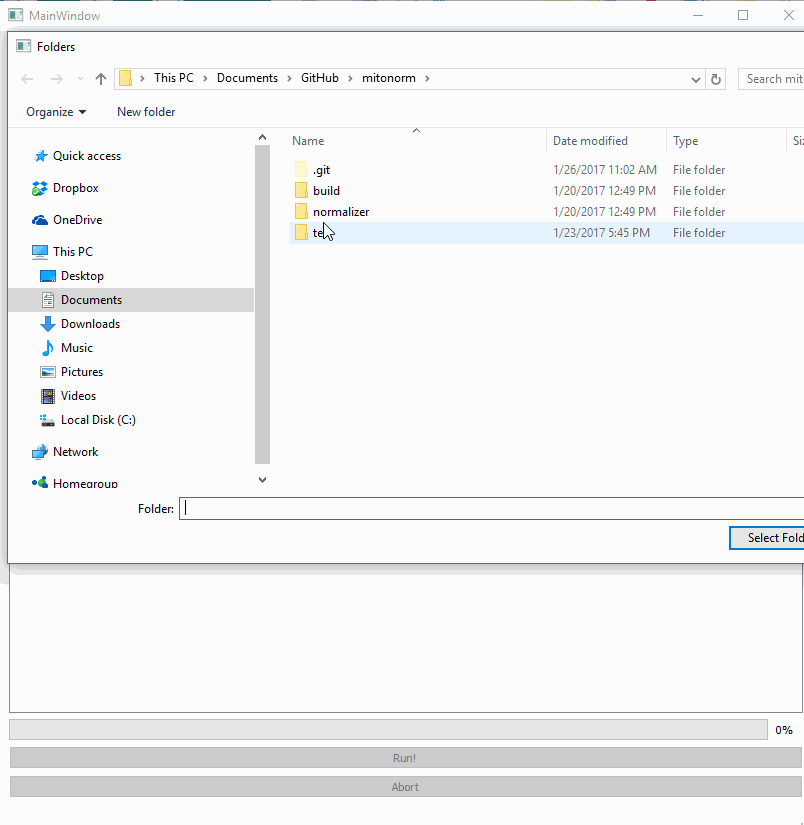

# Mitograph normalizer: normalizes outputs from Mitograph V2
Mitograph normalizer provides a GUI interface to automatically normalize two
channels along a skeletonized 3D network. The output of Mitograph normalizer is
a background corrected, focal plane independent 3D 'heatmap' of one channel
containing the signal of interest (for example, mitochondrial membrane potential)
along the skeleton which was defined by the output of the second channel. This is
similar to co-localization of two channels, but in 3D.

The executable (for Windows) standalone program is available in a zipped file:
https://www.dropbox.com/sh/bzgdo8wlhif8572/AACS6GvztmEXa1ZmRsvxNmrZa?dl=0

The `/test` folder contains sample data that the user can use to try out the
program.

## Instruction for use
1. First, run [Mitograph](https://github.com/vianamp/MitoGraph) with the output
 `export_image_resampled` flag:

  `./MitoGraph -xy 0.056 -z 0.2 -path /path_to_data_folder -export_image_resampled`

  The user should have already provided the cropped image stack of both channels
  to folder listed in *path_to_data_folder*. Both channels will be skeletonized
  and a *resampled* file will be generated for both channels.

2. Make sure that the files output from Mitograph have the following format:
  * `XXXXXXX_ch2_xxx_skeleton.vtk`
  * `XXXXXXX_ch1_xxx_resampled.vtk`
  * `XXXXXXX_ch2_xxx_resampled.vtk`

  where `XXXXXXX` is a prefix containing any alphanumeric (A-Za-z0-9_) character of any length
  that the user can use to label the experimental conditions or any other
  metadata, while `xxx` is a 3 digit sequence that the user will use to uniquely
  identify the cell/file data.

  >The important thing is to ensure that the skeleton file has the **ch2** and
  **skeleton** label while the resampled files has the **ch1** or **ch2** and **resampled**
  label in the correct positions *separated by underscores*.

3. Make sure the three type of files (skeleton, ch1 resampled and ch2 resampled)
 are in one folder. Hit the `Select Folder where data is Located` button.
 This will tell the program where the files are located.

 *The program will not let you continue if the files are not found or if the
  number of files for each channel is not the same.*

4. Hit `Run!` button. Wait for program to finish. You can press `Abort` to stop
the program at any time.

5. The normalized channel data will be written to a `Normalized` subfolder
(in the same folder where the original data was located, for e.g.
`/test/Normalized`) with each file in the format:

  * `Normalized_XXXXXXX_ch2_xxx_mitostack.vtk`

    Notice that the original file has now been appended with **Normalized** and
    **mitostack** to the original label. Also it is **ch2** that is outputted since
    that was the channel that provided the skeleton information for
    normalization (i.e. the normalized skeleton is based on channel 2).

6. Use [Paraview](http://www.paraview.org/),
 [Mayavi](http://code.enthought.com/projects/mayavi/) or any other suitable
 software to visualize the normalized channel on the skeleton. If using Paraview,
 under the *Coloring* toolbar, select either `normalized_dy` to provide a
 heatmap with a range of 0.0 - 1.0 or `unscaled_dy` for a heatmap containing the
 raw intensity units (a.u.).

## Instruction for building a binary file

1. Download and install [Miniconda](https://conda.io/miniconda.html)
2. Open up a shell, type:

   (Mac OS): `source activate root`

   (Windows): `activate root`

   Verify that the *root* environment for Conda has been activated by typing:

   `conda info --envs`

   You should see __*root__ environment with an asterisk.

3. `cd` into the *mitonorm* folder which should contain an *environment.yml* file.
 Update the *root* environment using the *environment.yml* file by typing:

   `conda env update -n root -f environment.yml`

4. Verify the dependencies have been installed by typing:

  `conda list`

  **Make sure that Numpy, VTK, Pyqt and Pyinstaller are listed.**

5. Build a one folder binary by typing (again make sure that the current):

  `Pyinstaller normalizer.spec`

  The executable file `normalizer` is by default created in
   `./dist/normalizer`. The normalizer folder can be zipped for a smaller
   distribution size.
