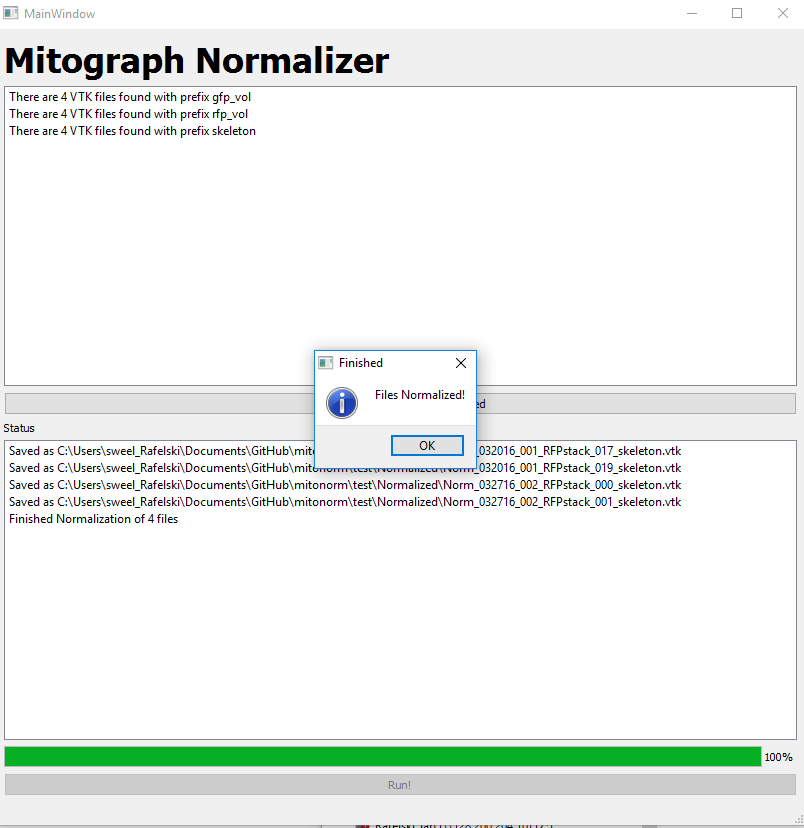

# Mitograph normalizer: normalizes outputs from Mitograph V2

The executable (for Windows) standalone program is available in a zipped file:
https://www.dropbox.com/sh/bzgdo8wlhif8572/AACS6GvztmEXa1ZmRsvxNmrZa?dl=0
